## Introduction
#### Workspace: D:/1Techniques/Programing_intro/Programing_intro.Rproj

This document contains the code needed for the second workshop in the MB5370 "Introduction to Programming" module.

This workshop focuses on understanding data visualization through the ggplot package


This is the raw plots of the mpg data from which the rest of this document will modify and work with.

## Creating a ggplot


``` r
ggplot(data = mpg) + 
  geom_point(mapping = aes(x = displ, y = hwy))
```

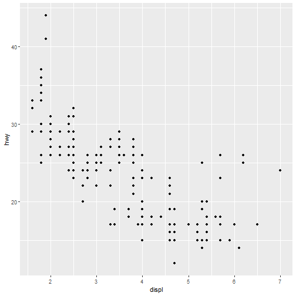

## Graphing template

ggplot(data = <DATA>) + <GEOM_FUNCTION>(mapping = aes(<MAPPINGS>))


``` r
ggplot(data = mpg) #This creates a blank data window as no axis information has been given to all the display of the included data
```


``` r
# Change point colour by class
ggplot(data = mpg) + 
  geom_point(mapping = aes(x = displ, y = hwy, colour = class))
```

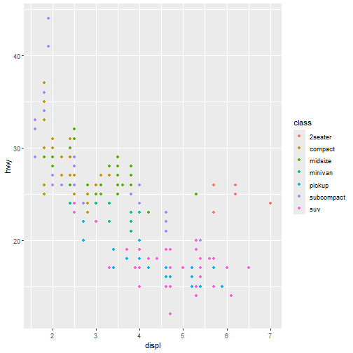

``` r
# Manually change point colour by class
ggplot(data = mpg) + 
  geom_point(mapping = aes(x = displ, y = hwy), color = "blue")
```

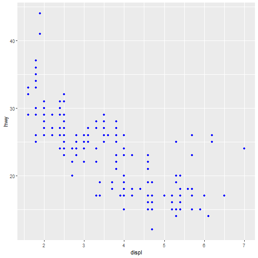

``` r
# Change point size by class
ggplot(data = mpg) + 
  geom_point(mapping = aes(x = displ, y = hwy, size = class))
```

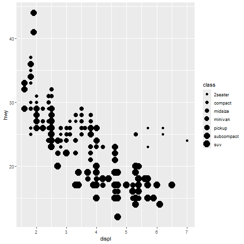

``` r
# Change point transparency by class
ggplot(data = mpg) + 
  geom_point(mapping = aes(x = displ, y = hwy, alpha = class))
```

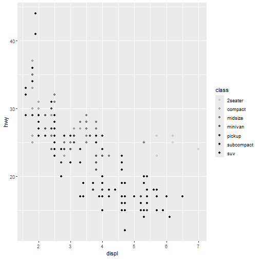

``` r
# Change point shape by class
ggplot(data = mpg) + 
  geom_point(mapping = aes(x = displ, y = hwy, shape = class))
```

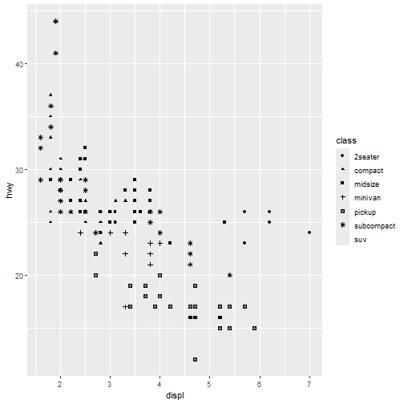

``` r
# Exercise
ggplot(data = mpg) + 
  geom_point(mapping = aes(x = displ, y = hwy, shape = class, colour = displ < 5)) #colour separates by whether "displ" is less than 5 - true or false
```

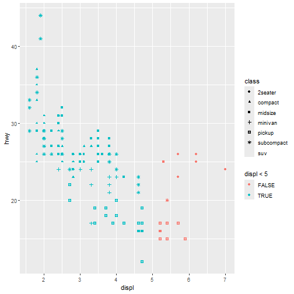


``` r
ggplot(data = mpg) + 
  geom_point(mapping = aes(x = displ, y = hwy)) + 
  facet_wrap(~ class, nrow = 2) # the ~ dictates which variable you want to subset your data with 
```

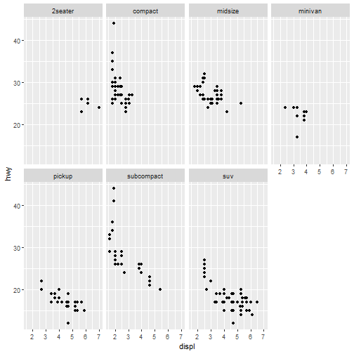

``` r
ggplot(data = mpg) + 
  geom_point(mapping = aes(x = displ, y = hwy)) + 
  facet_grid(drv ~ cyl) #facets plots based on the combination of two variables, you can use a "." if you dont want to facet in the rows or columns dimension
```

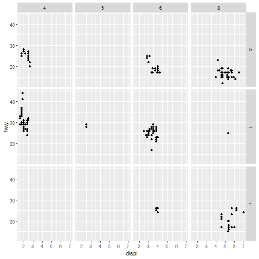

### Exercise 1

Read ?facet_wrap. What does nrow do? What does ncol do? What other options control the layout of the individual panels? nrow and ncol both give the number of each, nrow = number of rows and ncol = number of columns. scales controls the layout by setting the scale of each of the pannels, fixed is the default, free allows the data to set the scale and can also be set as a whole or by dimension

## Fitting simple lines


``` r
ggplot(data = mpg) + 
  geom_point(mapping = aes(x = displ, y = hwy)) #displays data as points
```


``` r
ggplot(data = mpg) + 
  geom_smooth(mapping = aes(x = displ, y = hwy)) #this takes the points and instead displays it as a smoothed line 
```

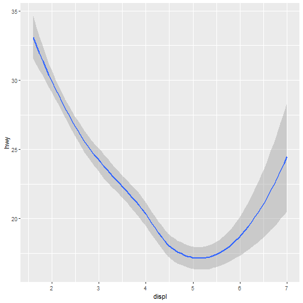

``` r
ggplot(data = mpg) +
  geom_smooth(mapping = aes(x = displ, y = hwy, linetype = drv)) #line type creates separate lines based on the "drv" variable 
```

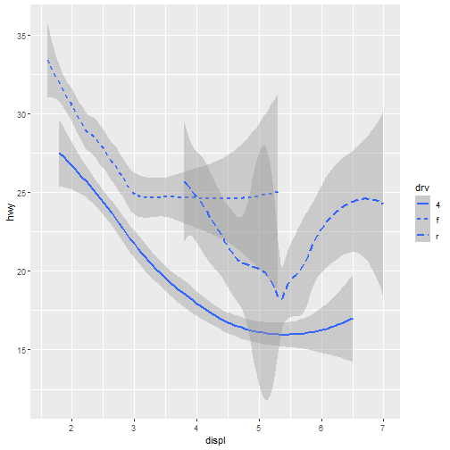

``` r
ggplot(data = mpg) +
  geom_smooth(mapping = aes(x = displ, y = hwy, group = drv)) #by grouping the data you show the data is in fact grouped but separated by discreate variables
```

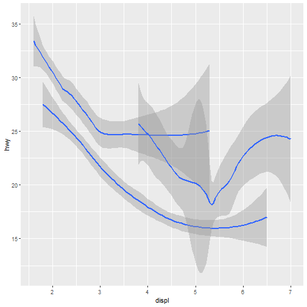

``` r
ggplot(data = mpg) +
  geom_smooth(
    mapping = aes(x = displ, y = hwy, color = drv), #this changes the colour of the lines by their "drv" and thus also separates them
    show.legend = FALSE) #this hide the colour legend
```

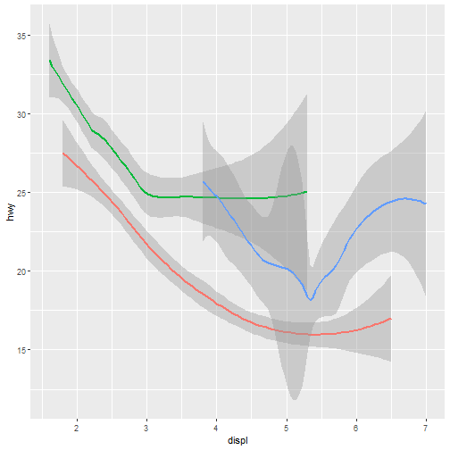

``` r
ggplot(data = mpg) + 
  geom_point(mapping = aes(x = displ, y = hwy)) + 
  geom_smooth(mapping = aes(x = displ, y = hwy))
```


``` r
#this plot shows both the point data and the data as a smooth line but the multiple lines can be confusing so instead we show it as below
ggplot(data = mpg, mapping = aes(x = displ, y = hwy)) + 
  geom_point(mapping = aes(color = class)) +  #we can still change the asetheics of each visualisation
  geom_smooth()
```

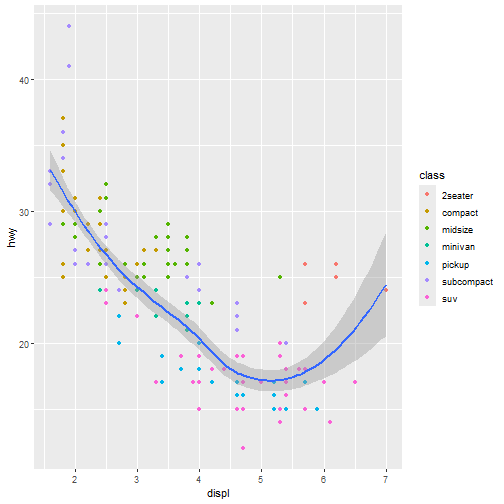

``` r
ggplot(data = mpg, mapping = aes(x = displ, y = hwy)) + 
  geom_point(mapping = aes(color = class)) + 
  geom_smooth(data = filter(mpg, class == "subcompact"), se = FALSE) #the subcompact feature then also allows us to select a subset of the data and only plot that 
```

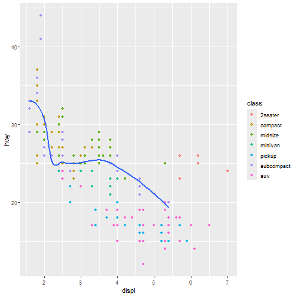

### Exercise 2

1.  *What geom would you use to draw a line chart? A boxplot? A histogram? An area chart?*

    The geom_line plots a line that connects each individual data point but geom_smooth creates a line of best fits. To make a boxplot you use geom_boxplot, a histogram is geom_bar and an area chart is geom_area.

2.  *Run this code in your head and predict what the output will look like. Then, run the code in R and check your predictions. Will these two graphs look different? Why/why not?*

    My prediction is that both these graphs will look the same as they are displaying the same information [data = mpg, mapping = aes(x = displ, y = hwy)] but the first one sets the information before setting how the data is displayed and the second lot of code sets the information within each of the display code.


``` r
ggplot(data = mpg, mapping = aes(x = displ, y = hwy)) + 
  geom_point() + 
  geom_smooth()
```


``` r
ggplot() + 
  geom_point(data = mpg, mapping = aes(x = displ, y = hwy)) + 
  geom_smooth(data = mpg, mapping = aes(x = displ, y = hwy))
```

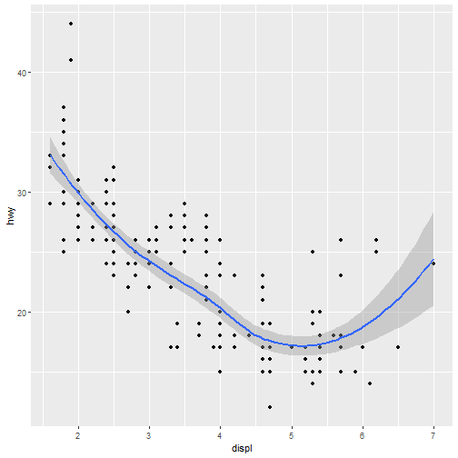

## Transforming and Stats

Using a new dataset "Diamonds" we are going to explore transfomations and data summaries. Our first bar chart shows that more diamonds are available with high quality cuts than low quality cuts.


``` r
ggplot(data = diamonds) + 
  geom_bar(mapping = aes(x = cut))
```


``` r
ggplot(data = diamonds) + 
  stat_count(mapping = aes(x = cut)) #geoms and stats can often be used interchangeably
```

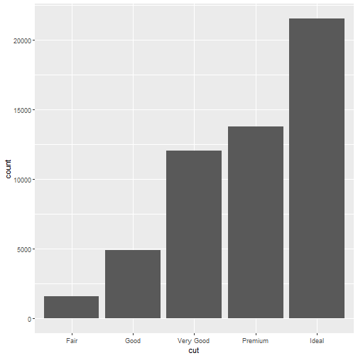
### Overriding defults 

``` r
demo <- tribble(
  ~cut,         ~freq,
  "Fair",       1610,
  "Good",       4906,
  "Very Good",  12082,
  "Premium",    13791,
  "Ideal",      21551
)
demo
```

```
## # A tibble: 5 × 2
##   cut        freq
##   <chr>     <dbl>
## 1 Fair       1610
## 2 Good       4906
## 3 Very Good 12082
## 4 Premium   13791
## 5 Ideal     21551
```

``` r
ggplot(data = demo) +
  geom_bar(mapping = aes(x = cut, y = freq), stat = "identity")
```

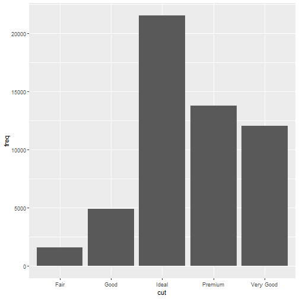


``` r
ggplot(data = diamonds) + 
  geom_bar(mapping = aes(x = cut, y = stat(prop), group = 1))
```

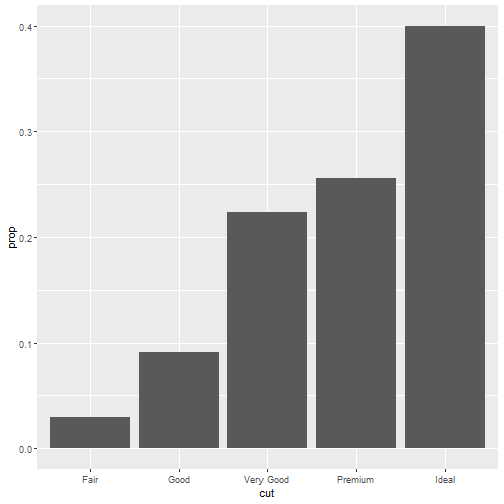
### Ploting staticical details

``` r
ggplot(data = diamonds) + 
  stat_summary(
    mapping = aes(x = cut, y = depth),
    fun.min = min,
    fun.max = max,
    fun = median)
```

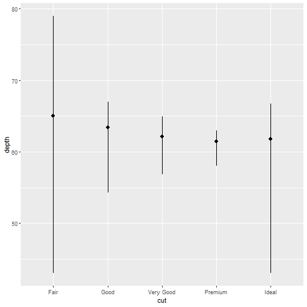
## Aesthetic Adjustments 

``` r
ggplot(data = diamonds) + 
  geom_bar(mapping = aes(x = cut, colour = cut)) #colour changes the line work of the graphs 
```

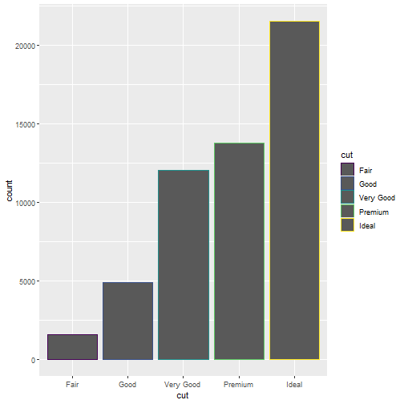

``` r
ggplot(data = diamonds) + 
  geom_bar(mapping = aes(x = cut, fill = cut)) #fill changes the internal colours of the graph 
```

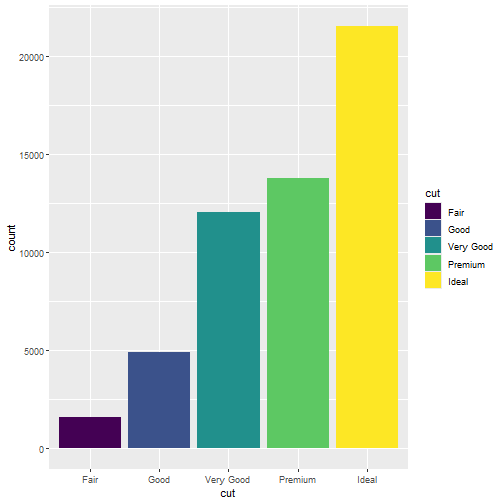

``` r
ggplot(data = diamonds) + 
  geom_bar(mapping = aes(x = cut, fill = clarity)) #changes in the variable can display the data differently 
```

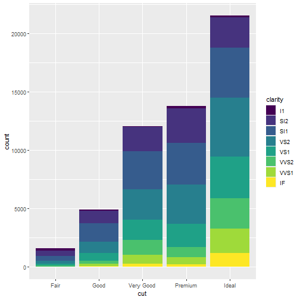

``` r
#To alter transparency (alpha)
ggplot(data = diamonds, mapping = aes(x = cut, fill = clarity)) + 
  geom_bar(alpha = 1/5, position = "identity") 
```

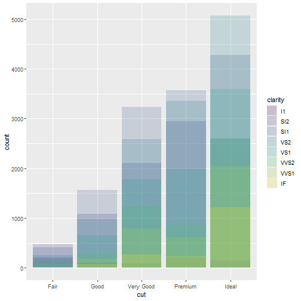

``` r
#To color the bar outlines with no fill color
ggplot(data = diamonds, mapping = aes(x = cut, colour = clarity)) + 
  geom_bar(fill = NA, position = "identity")
```

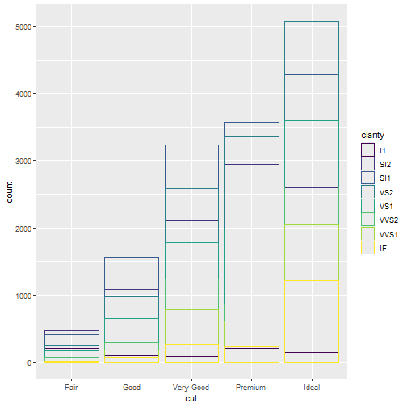

``` r
ggplot(data = diamonds) + 
  geom_bar(mapping = aes(x = cut, fill = clarity), position = "fill") #fill makes each of the bars the same size (filling the plot)
```

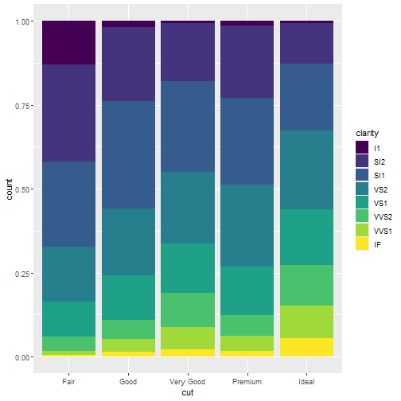

``` r
ggplot(data = diamonds) + 
  geom_bar(mapping = aes(x = cut, fill = clarity), position = "dodge") #dodge separates the stacked variables displaying them beside each other 
```

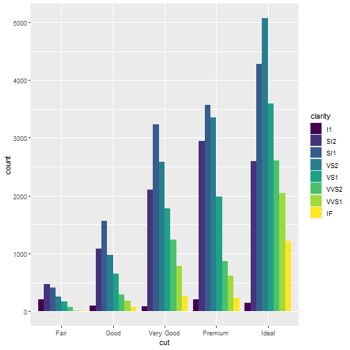

``` r
ggplot(data = mpg) + 
  geom_point(mapping = aes(x = displ, y = hwy), position = "jitter") #this adds a small amount of noise to separate any overlapped data points
```

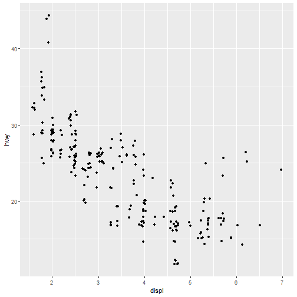

## The Layered Grammar of Graphics 
The new template for making a ggplot2, now with position adjustments, stats, and faceting included. 

ggplot(data = <DATA>) + 
  <GEOM_FUNCTION>(
     mapping = aes(<MAPPINGS>),
     stat = <STAT>, 
     position = <POSITION>
  ) +
  <FACET_FUNCTION>
